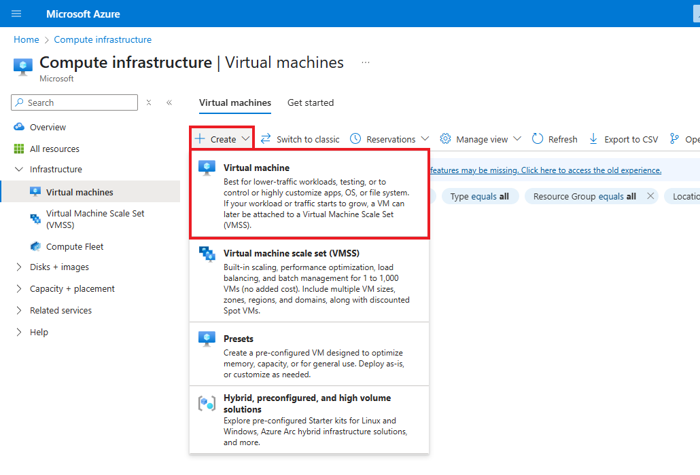
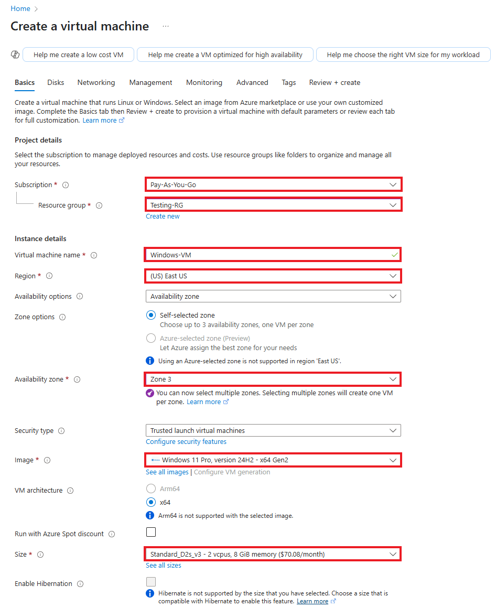
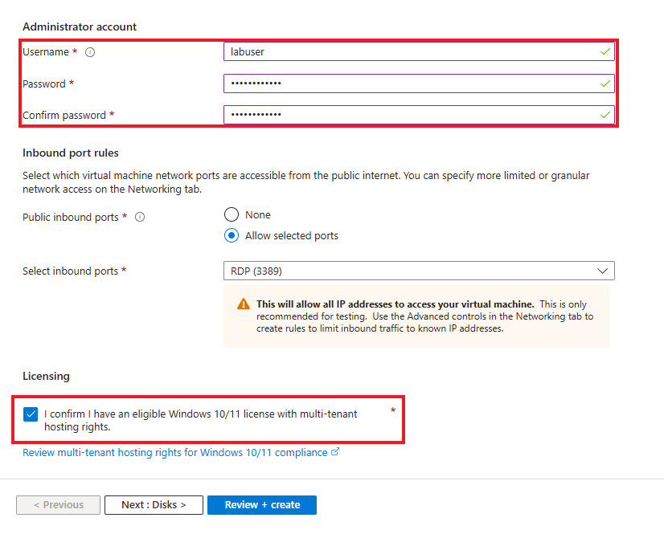
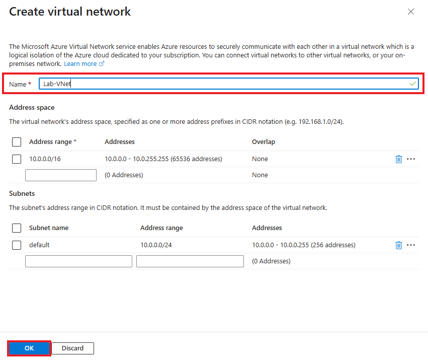
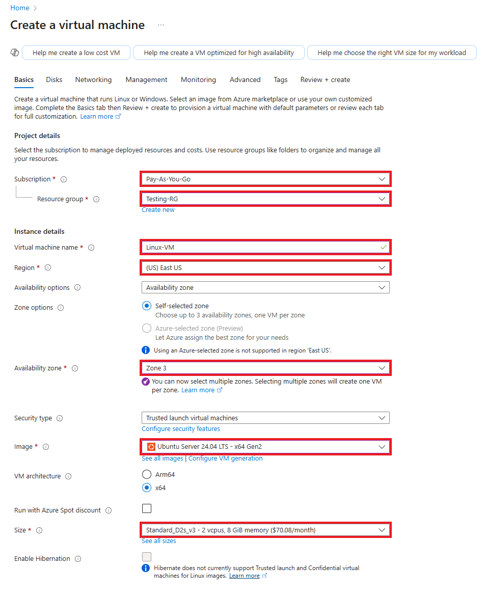
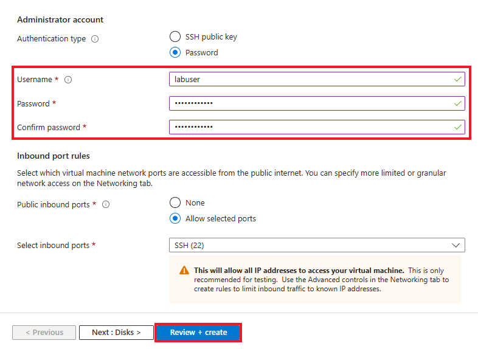
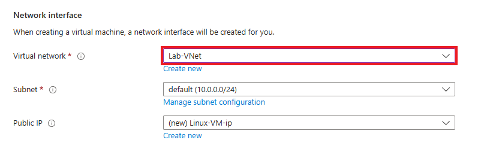
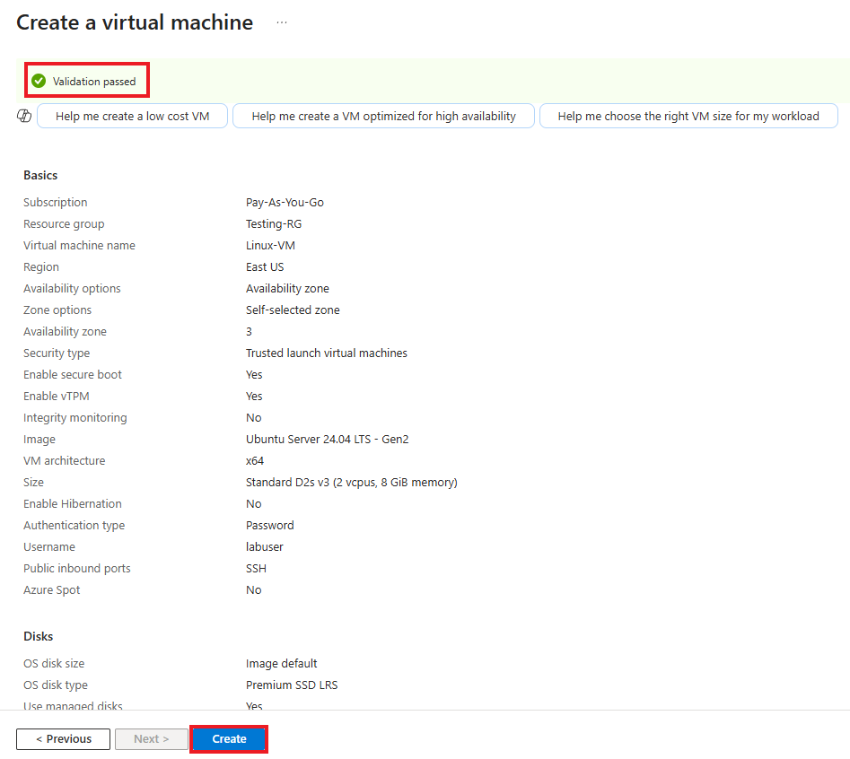

# Setting up Virtual Machines within Azure

This tutorial outlines the steps to create and configure virtual machines within Azure. This is a prerequisite step, as the virtual machines will be used to inspect network protocols.

## Prerequisites Needed
- Microsoft Azure Subscription (Free/Pay as you go)
  
## Environments Used
- Microsoft Azure (Cloud Environment)
- Windows 11 Pro (Virtual Machine OS)
- Ubuntu Server 24.04 (Virtual Machine OS)

## Technologies Used
- Azure Virtual Machines

## Setup Instructions

*NOTE: Ensure that you are logged into your Microsoft Azure account, and have a subscription active*

## Step 1: Create a new resource group within Microsoft Azure

1.1 After logging into your Azure account, navigate to/search for "Resource Groups":

1.2 On the Resource Groups page, click Create to start a new resource group:

1.3 Fill out the following information:
- Select your subscription
- Name your resource group. For this lab it will be titled **Testing-RG**
- Choose the region you are residing in. For this lab, we will select **(US) East US**

Then Click Review + create to proceed.

Following this, you will be prompted to review your new resource group information on the next page. Ensure the information entered is correct, and then click Create to Proceed.

**A resource group has now succcesfully been created.**

## Step 2: Create a Windows 11 Virtual Machine

2.1 Search for "Virtual Machine" in the search bar, or navigate to the Virtual Machine section back on the home page.

2.2 On the Virtual Machine page, click **Create**, and then select **Virtual machine**.

2.3 Fill out the following information:
- Subscription - Select your current and active subscription
- Resource Group - Select the resource group previously made in Step 1: **"Testing-RG"**
- Virtual machine name - For this lab, we will name our VM:  **"Windows-VM"**
- Region - Select your current region. For this lab, we will select **"(US) East US"**
- Availablity Zone - Select **"Zone 3"**
- Image - Select **"Windows 11 Pro, version 24H2 - x64 Gen2"**
- Size - Select **"Standard_D2s_v3 - 2vcpus, 8GiB memory ($70.08/month)"**

Create your **Administrator account**.

- For this lab, we will use **labuser** as the username and **Cyberlab123!** as the password.

Check off the Licensing check box

Click **Next: Disks>**, and then **Next: Networking >**

Click **Create new** under Virtual Network. A window to create a virtual network should pop up

Create your **Virtual Network**

- For this lab, we will use **Lab-VNet** as the name of our virtual network

Click **OK** to proceed

Back on the Virtual Machine page, Click **Review + Create** to proceed  

Confirm that **Validation passed** for your virtual machine.

Review the the information you inputted, ensuring everything is correct.

Click **Create** once more to initialize deployment of your virtual machine.

**A Windows 11 Virtual Machine has now successfully been created.**

## Step 3: Create a Linux (Ubuntu Server) Virtual Machine

3.1 Search for "Virtual Machine" in the search bar, or navigate to the Virtual Machine section back on the home page.

3.2 On the Virtual Machine page, click **Create**, and then select **Virtual machine**.

3.3 Fill out the following information:
- Subscription - Select your current and active subscription
- Resource Group - Select the resource group previously made in Step 1: **"Testing-RG"**
- Virtual machine name - For this lab, we will name our VM:  **"Linux-VM"**
- Region - Select your current region. For this lab, we will select **"(US) East US"**
- Availablity Zone - Select **"Zone 3"**
- Image - Select **"Ubuntu Server 24.04 LTS - x64 Gen2"**
- Size - Select **"Standard_D2s_v3 - 2vcpus, 8GiB memory ($70.08/month)"**

Create your **Administrator account**.

- Select **Password** option for **Authentication Type**
- For this lab, we will use **labuser** as the username and **Cyberlab123!** as the password.

Click **Next: Disks>**, and then **Next: Networking >**

For our Virtual Network, we will be selecting the virtual network that we created when creating our Windows 11 virtual machine: **Lab-VNet**

Click **Review + Create** to proceed  

Confirm that **Validation passed** for your virtual machine.

Review the the information you inputted, ensuring everything is correct.

Click **Create** once more to initialize deployment of your virtual machine.

**A Linux Ubuntu Virtual Machine has now successfully been created** 👍
