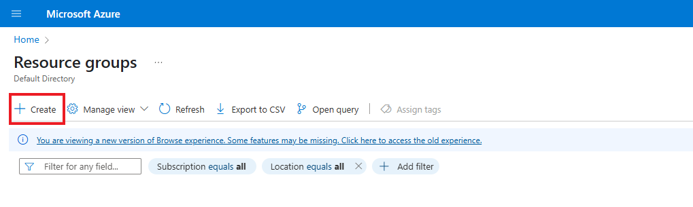
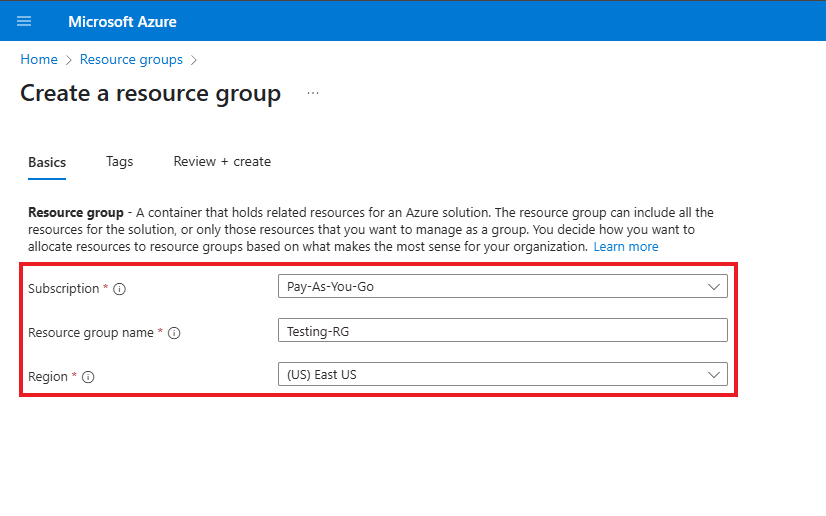
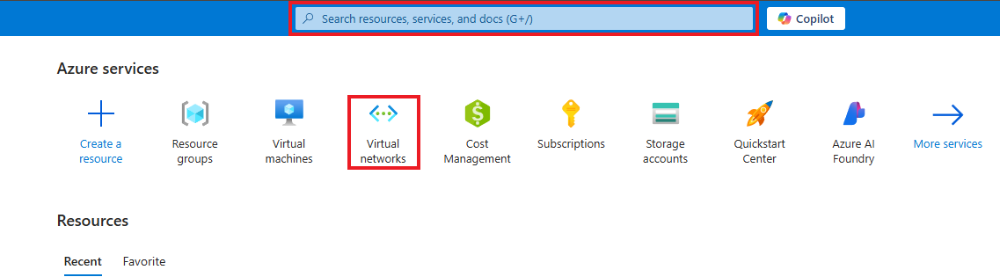

# Setting up Virtual Machines within Azure

This tutorial outlines the steps to create and configure virtual machines within Azure. This is a prerequisite step, as the virtual machines will be used to inspect network protocols.

## Prerequisites Needed
- Microsoft Azure Subscription (Free/Pay as you go)
  
## Environments Used
- Microsoft Azure (Cloud Environment)
- Windows 11 Pro (Virtual Machine OS)
- Ubuntu Server 24.04 (Virtual Machine OS)

## Technologies Used
- Azure Virtual Machines

## Setup Instructions

*NOTE: Ensure that you are logged into your Microsoft Azure account, and have a subscription active*

## Step 1: Create a new resource group within Microsoft Azure

1.1 After logging into your Azure account, navigate to/search for "Resource Groups":

1.2 On the Resource Groups page, click Create to start a new resource group:

1.3 Fill out the following information:
- Select your subscription
- Name your resource group. (For this lab's purpose, it will be titled *Testing-RG*)
- Choose the region you are residing in

Then Click Review + create to proceed.

Following this, you will be prompted to review your new resource group information on the next page. Ensure the information entered is correct, and then click Create to Proceed.

**A resource group has now succcesfully been created.**

## Step 2: Create a Windows 10 Virtual Machine

2.1 Search for "Virtual Machine" in the search bar, or navigate to the Virtual Machine section back on the home page.

2.2 On the Virtual Machine page, click **Create**, then select **Virtual machine**.

