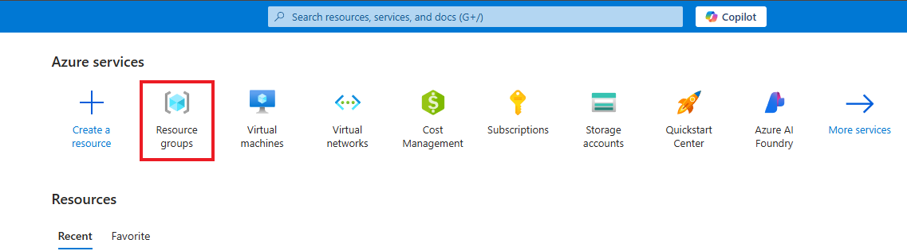

# Setting up Virtual Machines within Azure

This tutorial outlines the steps to create and configure virtual machines within Azure. This is a prerequisite step, as the virtual machines will be used to inspect network protocols.

## Prerequisites Needed
- Microsoft Azure Subscription (Free/Pay as you go)
  
## Environments Used
- Microsoft Azure (Cloud Environment)
- Windows 11 Pro (Virtual Machine OS)
- Ubuntu Server 24.04 (Virtual Machine OS)

## Technologies Used
- Azure Virtual Machines

## Setup Instructions

*NOTE: Ensure that you are logged into your Microsoft Azure account, and have a subscription active*

### Step 1: Create a new resource group within Microsoft Azure

- After logging into your Azure account, navigate to/search for "Resource Groups".

- On the Resource Groups page, click Create to start a new resource group.

- 
<!Provide the steps on how to create a resource groups. Add images of each step, provide small description, and explanation on why we are doing this depending on the step>
### 
